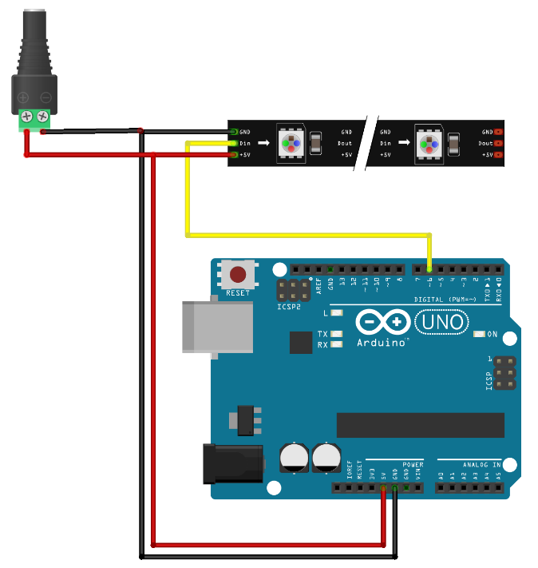
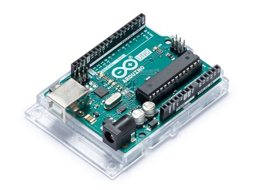
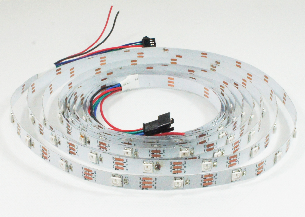
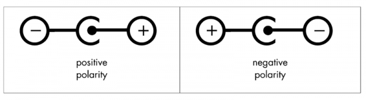
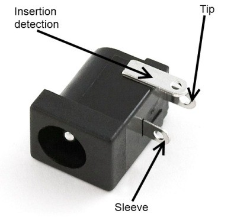
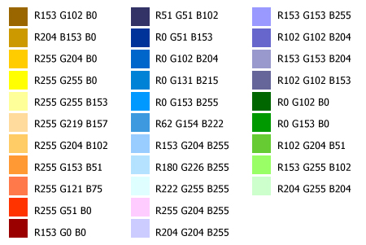

# Christmas-Lights
Let's make Christmas Lights with Arduino Uno

Arduino homepage:\
https://www.arduino.cc/

## Creating circuits online
Tinkercad is a good place to start:
https://www.tinkercad.com/

Circuit for current project

## Arduino IDE
**Arduino IDE** For writing, errorchecking and uploading code to Arduino:\
https://www.arduino.cc/en/software

## Components needed

### Microcontroller

  

*Arduino UNO microcontroller

### Led Strip

  

*WS2812 RGB 5V 18W IP20 Adressable Led Strip

*Arrow on the strip shows data direction
*Led strips with a chip won't light up when power is connected. Without data connection leds will stay off.
*WS2812 LED strip needs externalt power adapter because it needs too mutch power from Arduino.\
**Every RGB LED needs 60 mA**(3 x 20 mA, Red, Green, Blue). 
*E.g. 1m LED strip with 60 RGB leds needs 3 x 20 x 60 = 3600 mA = 3.6 A

### Power Adapter
For current project we use 5 volts 4 amps AC/DC adapter 5.5/2.1 mm.\
(Our 1 m led strip needs 3.6 amps)

*When Arduino is connected with USB cable, then from it's power line can be used only about **~400mA**.
*When Arduino is connected with 9-12V, then the output from 5V is about **~900mA**.

  

*5VDC 4A adapter(GS18E05-P1J)

On most power adapter cases are displayed (+/-)polarity:

## Color Codes
**RGB** colors are composite of Red, Green and Blue color. Every color has value between 0 and 255, where 0 is OFF and 255 is the brightest. So the brightest color value is **255.255.255**. When all 3 values are equal, then the color is on black-white scale(gray). For example 206.206.206.
Some color calculators:\
https://www.w3schools.com/colors/colors_rgb.asp
https://htmlcolorcodes.com/color-chart/ 

Example color codes:

